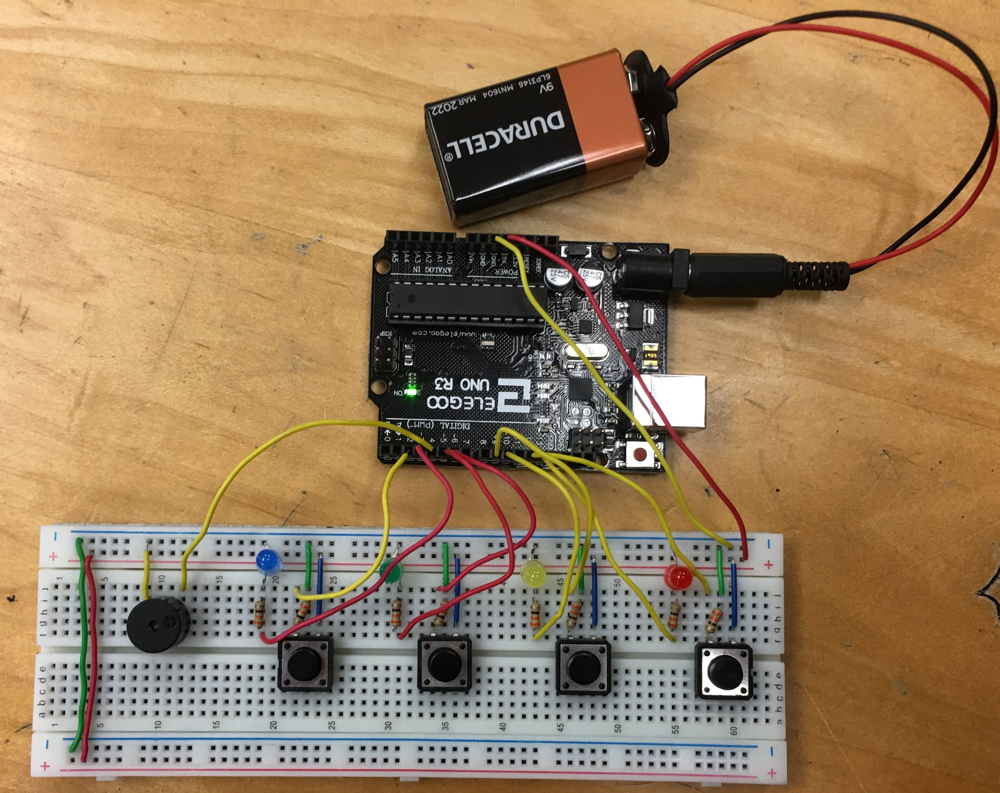
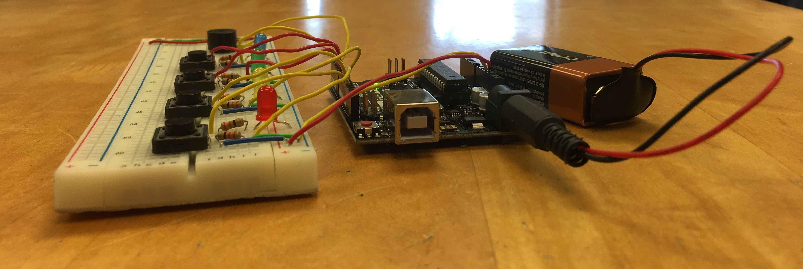

# *Simon* Arduino Project

## Description
*Simon* is an electronic game created in the 1970s that tests the users ability to remember patterns. It plays a pattern by lighting up and making a sound, and then the user has to repeat that pattern by pressing the corresponding buttons. If a user correctly enters it, they'll be given a new, more challenging pattern. [More information available here](https://en.wikipedia.org/wiki/Simon_(game).  

## Our Implementation
I, along with a friend, recreated this using an Arduino, LEDs, buttons, and a few other items. I wrote the majority of the code while my friend did most of the hardware work. While the file extension is .ino, it is based off C++ with only a few differences from it.  

While we did not have an original *Simon* device present to compare it with, we essentially mimicked the functionality.  

The game has four LEDs, each which have their own musical note that plays when the corresponding LED lights up. There are four game buttons that correspond with each individual LED, along with a reset button.  

When the game begins, a random pattern is generated and played. If the user enters it correctly, they'll hear a short, happy sound effect, and then a new random, longer pattern will be played. This will continue until they mess up, in which case a short, sad sound effect will play, and the game restarts.  

  

## Process and How-To
If you wish to re-create this project or learn about the process behind it, check out the [lab report](LabReport.pdf) in this branch.
